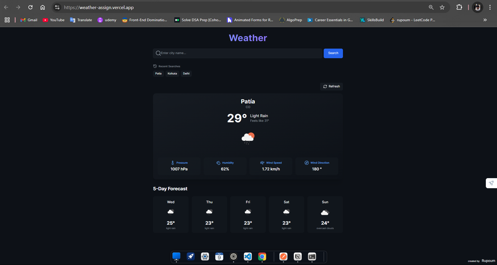

# Weather Dashboard

A beautiful, responsive weather dashboard built with Next.js that allows users to search for any city and view its current weather information and 5-day forecast.

## 🌟 Features

- **City Search**: Search for weather information by city name
- **Current Weather**: View detailed current weather including:
  - Temperature
  - Weather condition with icon
  - Humidity
  - Wind speed and direction
  - Atmospheric pressure
- **5-Day Forecast**: See weather predictions for the next 5 days
- **Recent Searches**: Quick access to your last 5 searched cities
- **Responsive Design**: Works seamlessly on mobile, tablet, and desktop
- **Dark Theme**: Easy on the eyes with a modern dark interface
- **Smooth Animations**: Enhanced user experience with Framer Motion animations
- **Error Handling**: User-friendly error messages

## 🚀 Technologies Used

- [Next.js 14](https://nextjs.org/) - React framework with App Router
- [React](https://reactjs.org/) - UI library
- [Tailwind CSS](https://tailwindcss.com/) - Utility-first CSS framework
- [Framer Motion](https://www.framer.com/motion/) - Animation library
- [Lucide React](https://lucide.dev/) - Icon library
- [OpenWeatherMap API](https://openweathermap.org/api) - Weather data provider

## Api

-**Rate Limit**:Once you subscribe to One call API 3.0, 2000 API calls per day to this product are set up by default. -**Key**:10aacc1e1487c13fd5abc6b787d6ee98

## 📋 Prerequisites

Before you begin, ensure you have:

- Node.js 18.17.0 or later
- An OpenWeatherMap API key

## 🔧 Installation

1. Clone the repository:
   \`\`\`bash
   git clone https://github.com/yourusername/weather-dashboard.git
   cd weather-dashboard
   \`\`\`

2. Install dependencies:
   \`\`\`bash
   npm install

   # or

   yarn install

   # or

   pnpm install
   \`\`\`

3. Create a `.env` file in the root directory and add your OpenWeatherMap API key:
   \`\`\`
   OPENWEATHER_API_KEY=api_key
   \`\`\`

## 🖥️ Usage

### Development

Run the development server:

\`\`\`bash
npm run dev

# or

yarn dev

# or

pnpm dev
\`\`\`

Open [http://localhost:3000](http://localhost:3000) in your browser to see the application.

## 🌐 API Routes

The application uses server-side API routes to securely fetch data from OpenWeatherMap:

- `/api/weather?city={cityName}` - Fetches current weather data
- `/api/forecast?city={cityName}` - Fetches 5-day forecast data
